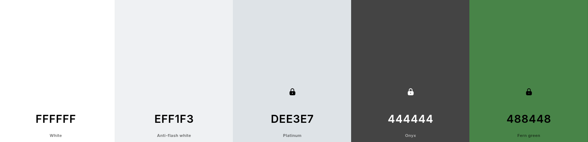

# femtocrank

A simple CSS theme with high accessibility and zero dependencies.

* **NPM:** https://www.npmjs.com/package/femtocrank
* **Blog post:** [Why do I use the same colors for everything?](https://blog.jread.com/posts/why-do-i-use-dee3e7/)

## Color Scheme

